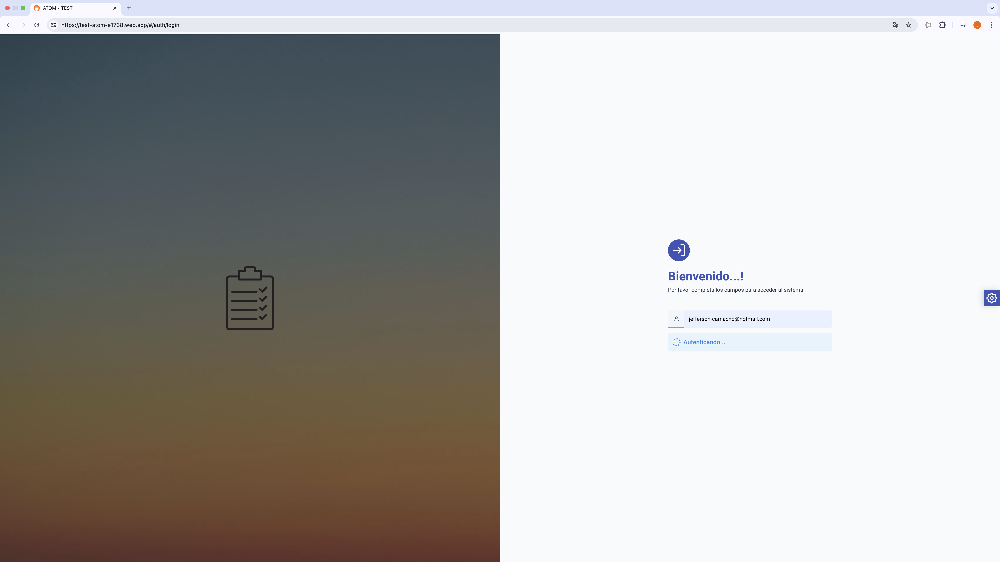
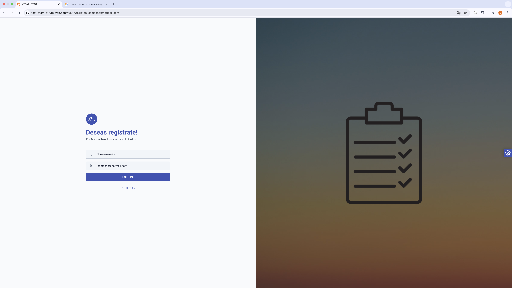
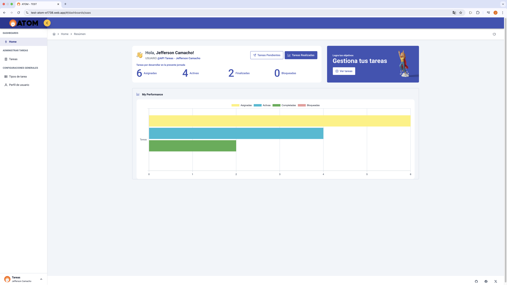
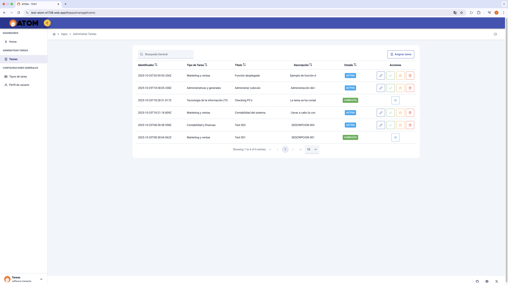
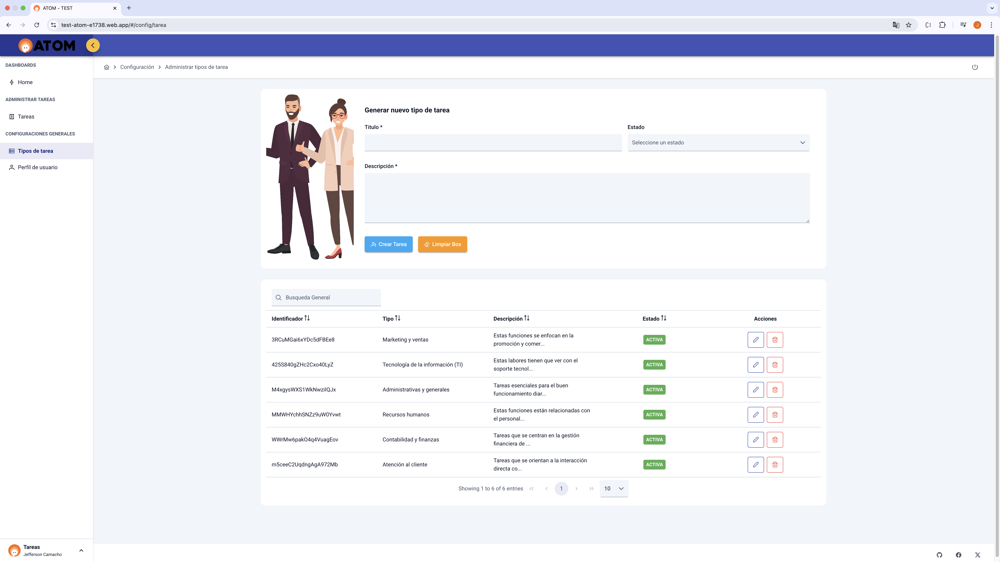
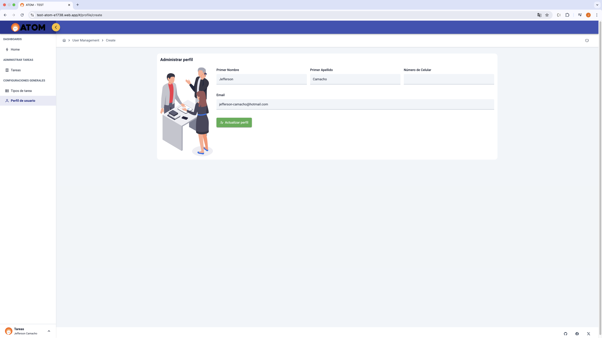

# Challenge Técnico - Aplicación de Gestión de Tareas (Frontend)

Una aplicación web desarrollada con **Angular** que permite la gestión de tareas de usuarios, incluyendo autenticación, creación, edición, eliminación y monitoreo de tareas.  
El proyecto fue construido con un enfoque **responsivo**, **modular** y orientado a **componentes**, utilizando **Firebase** como backend y herramientas del ecosistema **PrimeNG** para la interfaz de usuario.

---

## 🚀 Descripción general

La aplicación consta de dos páginas principales:

1. **Inicio de sesión:**  
   - Permite ingresar mediante correo electrónico.  
   - Si el usuario existe, se redirige al panel principal.  
   - Si no existe, se muestra un diálogo de confirmación para crear el usuario y acceder directamente.

2. **Panel principal (Dashboard):**  
   - Muestra todas las tareas pendientes ordenadas por fecha de creación.  
   - Permite agregar, editar, eliminar y marcar tareas como completadas o pendientes.  
   - Incluye un formulario para registrar nuevas tareas y un botón para cerrar sesión.  
   - Presenta estadísticas visuales sobre las tareas activas, completadas, asignadas y bloqueadas.  
   - Incluye un módulo para gestionar **tipos de tareas** y un módulo para actualizar la información del usuario logueado.

---

## ✨ Funcionalidades principales

- 🔐 **Autenticación por correo electrónico** (Firebase Authentication).  
- 🧾 **Gestión completa de tareas:** crear, editar, eliminar y cambiar estado.  
- 🧩 **Gestión de tipos de tareas** para clasificar las tareas creadas.  
- 👤 **Actualización de datos del usuario** (nombre, apellido, correo).  
- 📊 **Dashboard interactivo** con gráficas y estadísticas de desempeño (Chart.js).  
- 💬 **Indicadores visuales (GIFs y spinners)** para estados de carga o actualización.  
- 📱 **Diseño 100% responsivo**, adaptado a distintos dispositivos.  

---

## 🛠️ Tecnologías utilizadas

| Categoría | Herramientas |
|------------|---------------|
| **Framework Frontend** | Angular 19 (compatible desde Angular 17) |
| **Lenguaje** | TypeScript |
| **Gestor de paquetes** | npm |
| **Interfaz de usuario** | PrimeNG, PrimeFlex, PrimeIcons |
| **Gráficas** | Chart.js |
| **Backend / BaaS** | Firebase SDK (Firestore, Authentication, Hosting) |
| **Navegación y seguridad** | Angular Router, Guards, Interceptors (para token en peticiones HTTP) |
| **Despliegue** | Firebase Hosting |
| **Arquitectura** | Basada en componentes y módulos funcionales |

---

## 🧩 Estructura principal del proyecto

- **auth/** → Manejo de autenticación y login.  
- **manageRegister/** → Registro y administración de tareas.  
- **dashboard/** → Panel principal con estadísticas y vista general de tareas.  
- **user/** → Actualización de datos del usuario logueado.  
- **shared/** → Módulo compartido con componentes reutilizables y módulos PrimeNG.  

---

## ⚙️ Requisitos previos

- **Node.js:** versión 22 (recomendado)  
- **Angular CLI:** versión 19 (compatible desde 17)  
- **npm:** instalado y actualizado  

---

## 🧱 Instalación y ejecución local

1. **Clonar el repositorio:**
   ```bash
   git clone <URL_DEL_REPOSITORIO>
   cd nombre-del-proyecto

2. **Instalar dependencias:**
   ```bash
    npm install

3. **Configurar Firebase (environment.ts):**
    Crea un archivo src/environments/environment.ts con tus credenciales de Firebase:
    ```bash
    export const environment = {
        production: false,
        firebaseConfig: {
            apiKey: "TU_API_KEY",
            authDomain: "TU_DOMINIO.firebaseapp.com",
            projectId: "TU_PROJECT_ID",
            storageBucket: "TU_STORAGE_BUCKET",
            messagingSenderId: "TU_SENDER_ID",
            appId: "TU_APP_ID"
        }
    };

4. **Ejecutar el servidor local:**
    ```bash
    ng serve
    Luego abre http://localhost:4200 en tu navegador.

## 🌐 Despliegue
- El proyecto está actualmente desplegado en Firebase Hosting:
- 👉 https://test-atom-e1738.web.app/

## 📸 Vista previa

|  |  |  |
|-----------------------------------------|-----------------------------------------|-----------------------------------------|

|  |  |  |
|-----------------------------------------|-----------------------------------------|-----------------------------------------|

## 👨‍💻 Autor
Jefferson Camacho Muñoz  
FullStack Developer

🔗 [LinkedIn](https://www.linkedin.com/in/jefferson-camacho-323b0b1ba/) ↗